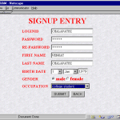

# Exam-System
# Exam-System
<b><u>Objective</b></u> 
Conducting a paperless examination is made available by using the concept of web based online examination, which includes automated processing system for all the works which was previously done by using human work power. This online examination system will able to work as two way road just by single system. Through this web application, it can be possible to conduct examination through internet or to a particular geographical region using the concept of LAN or through intranet for particular organization. 

<b>Users of system</b> 
<ul><li>Admin</li><li>Student</li></ul>
<b>Tools Used</b> 
1. Jdk  
2. Operating System :Ubuntu 
3. Back End :Mysql Activity.jpg
4. IDE : eclipse 
5. Front End : JAVA using SERVLETS 
6. Database Connectivity: JDBC 
   
<b> Project with Screenshots</b> 
 
 
 
 
 
<b>Class Diagram</b> 
 
<b>Activity Diagram</b> 
 
<b>Data Flow Diagram</b> 
 
